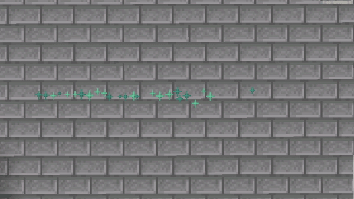
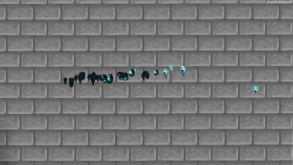
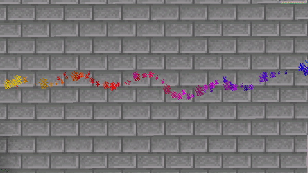

# Examples for You!

## How to use

Creating PathVisualizers may not be the easiest of tasks. Feel free to have a look at the
examples on this page. You don't have to use YML as Database Type. You don't even need to download
anything at all.
To install one of these Visualizers, simply join your server and enter the following command:

``/pathfinder import visualizer <name>|*``

## Important Note!

Some visualizers may rely on others, like Combined Visualizers would naturally have some other Visualizers
as children. These dependencies are not included with the provided import command.
To see, which visualizers to import first, check the table below.

## Images

<table style="word-break: break-all">
<thead>
<th style="min-width: 20%; max-width: 20%">Name</th>
<th style="width: 30%">Notes</th>
<th style="width: 50%">Image</th>
</thead>

<tr>
<td>example_simple <a href="pathfinder$example_simple.yml">pathfinder$example_simple.yml</a></td>
<td>-</td>
<td></td>
</tr>

<tr>
<td>example_ghosts <a href="pathfinder$example_ghosts.yml">pathfinder$example_ghosts.yml</a></td>
<td>-</td>
<td></td>
</tr>

<tr>
<td>example_rainbow <a href="pathfinder$example_rainbow.yml">pathfinder$example_rainbow.yml</a></td>
<td>Position wavers, to make it appear more random and natural. The particles are made with JavaScript, 

Performance might suffer more from JavaScript based Visualizers than simple Particle Visualizers!</td>
<td></td>
</tr>

</table>
